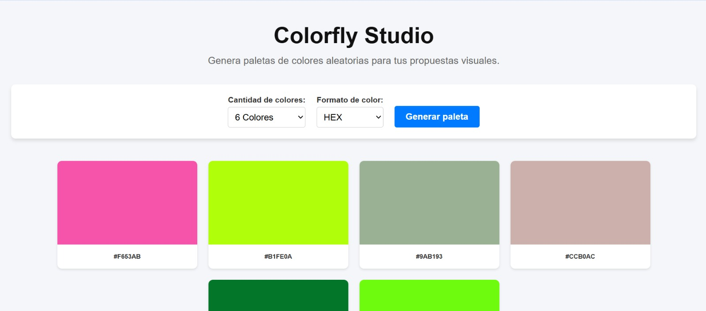
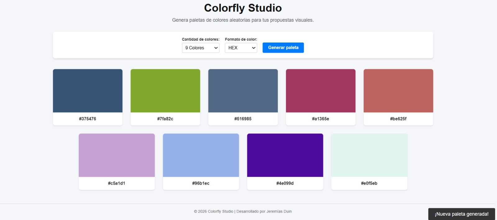
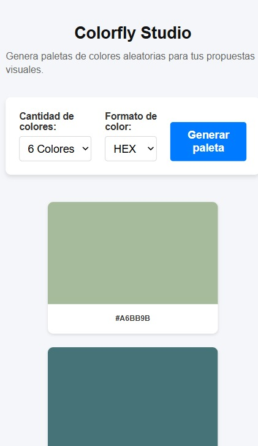

## 🎨 Colorfly Studio

Colorfly Studio es una aplicación web que permite generar paletas de colores aleatorias para proyectos de diseño y desarrollo web.

El usuario puede elegir la cantidad de colores que desea generar y el formato de visualización (HEX o HSL). Cada color puede copiarse al portapapeles con un solo clic.

## 🌐 Despliegue

GitHub Pages

- Ir al proyecto subido en GitHub.
- Ir a Settings.
- Seleccionar Pages.
- Elegir la rama main.
- Guardar los cambios.

GitHub generará automáticamente una URL pública para acceder a la pagina web que es la siguiente:

https://jereduin10.github.io/proyectoM1_JeremiasDuin/


## 🚀 Características

- Generación aleatoria de paletas de colores.
- Selección de 6, 8 o 9 colores.
- Soporte para formatos HEX y HSL.
- Copiado de colores al portapapeles.
- Notificaciones visuales (Toast).
- Diseño responsive.
- Implementación de buenas prácticas de accesibilidad.

## 🛠️ Tecnologías utilizadas
- HTML
- CSS
- JavaScript

## 📁 Estructura del proyecto 

```text 
proyectom1_jeremiasduin/
│
├── assets/
│   ├── capturas/
│   │   ├── inicio.jpeg
│   │   ├── genera-paleta.jpeg
│   │   ├── copiar-color.jpeg
│   │   └── responsive.jpeg
│   │
│   └── ia/
│       ├── prompt-1.jpeg
│       ├── prompt-2.jpeg
│       ├── prompt-3.jpeg
│       ├── prompt-4.jpeg
│       ├── prompt-5.jpeg
│       └── prompt-6.jpeg
│
├── index.html
├── style.css
├── script.js
├── README.md
```

## 💡 Decisiones técnicas

Durante el desarrollo se tomaron las siguientes decisiones:

- Uso de HTML semántico para mejorar la organización y accesibilidad.
- Separación del proyecto en archivos independientes (HTML, CSS y JavaScript).
- Uso de Flexbox para construir un diseño adaptable a diferentes resoluciones.
- Implementación de funciones independientes para facilitar el mantenimiento del código.
- Creación dinámica de las tarjetas mediante JavaScript utilizando createElement() y appendChild().
- Implementación de la API navigator.clipboard para copiar colores al portapapeles.
- Uso de atributos aria-label y aria-live para mejorar la experiencia de usuarios que utilizan tecnologías asistivas.
- Tipografía responsive mediante clamp().

## ▶️ Cómo ejecutar la aplicación

Clonar el repositorio:
git clone https://github.com/jereduin10/proyectoM1_JeremiasDuin

Acceder a la carpeta del proyecto:
cd proyectoM1_JeremiasDuin

Abrir el archivo index.html en cualquier navegador moderno.

## Como utilizar la aplicación web

### Pantalla de inicio



### Generación de una nueva paleta

Seleccionar la cantidad de colores y su formato. Luego clickear el botón generar paleta de colores.



### Copia de un color

Clickear el cuadro de un color para copiar el código del color seleccionado.


### Vista responsive



## Uso de inteligencia artificial

### Prompt 1

Consulta:

Contexto: Estoy haciendo el proyecto que te comentaba. Mi nivel es principiante.  
Instrucciones claras: Ayudame a ir completando el proyecto en el visual studio paso a paso, falta el Javascript.  
Restricciones: No quiero que utilices codigo complejo. Solo usa lineas faciles de leer pero que se vea bien.  
Formato deseado: Dame un formato simple pero vistoso.  

Respuesta:


### Prompt 2

Para poder cambiar los formatos de los colores de HEX a HSL y vice versa sin que se modifiquen los colores tuve que rehacer el codigo anterior haciendo que se guarde el color en el formato RGB.

Consulta:

Analizar mi Javascript. Necesito que hagas que cuando selecciono un color en la pestaña, sea HEX o HSL, se cambie pero no modifiques los colores seleccionados, solo cambie el formato HEX o HSL.

Respuesta:


## 📱 Responsive Design

La interfaz fue desarrollada para adaptarse correctamente a distintos tamaños de pantalla mediante:

- Flexbox.
- Distribución flexible de las tarjetas.
- Tipografías adaptables.
- Ajuste automático del contenido para dispositivos móviles y escritorio.

## 👨‍💻 Autor

Jeremías Duin